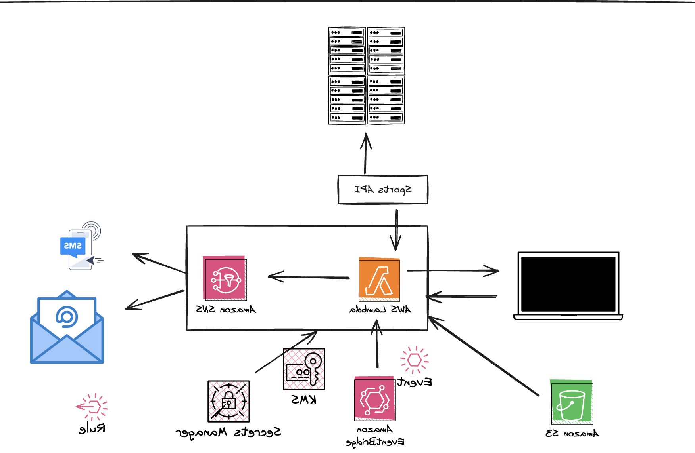

# GamedayNotification

This is the gameday notification project. This project focuses on notifying the user about upcoming game. we will use an nba api to get the data and notify the user about the upcoming game.

## Getting Started

To get started with this project, clone the repository and run the following command to install the required packages.

Lambda setup:

```
uv pip install requirements.txt
zip -r ../lambda_function.zip .
cd ..
zip lambda_function.zip main.py
aws s3 mb s3://<bucket-name>
aws s3 cp lambda_function.zip s3://<bucket-name>
```

To run sh file and deploy the cloudformation changes:

```
chmod +x script.sh
./deploy.sh
```

## System Design:


